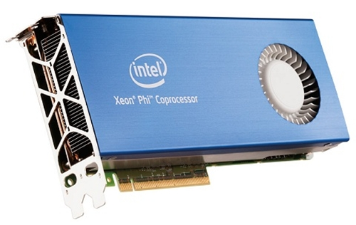

# Аппаратная часть

#### Параллелизм на уровне инструкций 

Программа состоит из множества инструкций к микропроцессору. Микропроцессор способен изменить порядок их выполенения, выделить среди инструкций группы, которые можно исполнять параллельно. При этом, результат вычислений не изменится.Так же микропроцессор способен предсказывать следующие инструкций. Ниже мы рассмотрим почему это бывает существенно. 

Данный уровень параллелизма эффективен в случае если вы хотите выжать максимум из своего железа. Однако, код после этого становится не переносимым.  

#### Иерархия памяти 
В большинстве современных ПК рассматривается следующая иерархия памяти:

* **Регистры** процессора, организованные в регистровый файл — наиболее быстрый доступ (порядка 1 такта), но размером лишь в несколько сотен или, редко, тысяч байт.

* **Кэш процессора 1го уровня (L1)** — время доступа порядка нескольких тактов, размером в десятки килобайт

* ** Кэш процессора 2го уровня (L2)** — большее время доступа (от 2 до 10 раз медленнее L1), около полумегабайта или более

* ** Кэш процессора 3го уровня (L3)** — время доступа около сотни тактов, размером в несколько мегабайт (в массовых процессорах используется недавно)

* **ОЗУ системы **— время доступа от сотен до, возможно, тысячи тактов, но огромные размеры в несколько гигабайт, вплоть до сотен. Время доступа к ОЗУ может варьироваться для разных его частей в случае комплексов класса NUMA (с неоднородным доступом в память)

* **Дисковое хранилище** — многие миллионы тактов, если данные не были закэшированны или забуферизованны заранее, размеры до нескольких терабайт

| Операция | Такты | Время мс | Отношение |
| -- | -- | -- | -- |
|Один такт процессора с частотой 3 ГГц| 1 | | |
| Обращение в кэш перого уровня L1  | 0.5 |   |  |
| Неверно предсказанный переход     | 5   |   | |
| Обращение в кэш второго уровня L2 | 7  |   | 14x L1 |
| Захват мьютекса                   | 100 |   |  |
| Обращение в оперативную память | 100 |   |20x L2 , 200x L1|
| Snappy сжатие 1 Кбайта данных  | 3000 |   | |
| Передача 2 Кбайт через 1 Гбит|10000|0.01||
| Прочитать произвольные 4 Кбайт данных с SSD|150000 |0.15 ||
| Прочитать последовательно 1 Мбайт данных из памяти |250000|0.25||
| Прочитать последовательно 1 Мбайт данных  с SSD |1000000|1|4x память|
| Прочитать последовательно 1 Мбайт данных из сети|10000000|10||
| Прочитать последовательно 1 Мбайт данных с диска|20000000|20|80x память, 40х SSD|

#### Мультипроцессорные системы 
Использование пары или большего количества физических процессоров в одной компьютерной системе. Термин также относится к способности системы поддержать больше чем один процессор и/или способность распределить задачи между ними. Существует много вариантов данного понятия, и определение многопроцессорности может меняться в зависимости от контекста, главным образом в зависимости от того, как определены процессоры (много ядер в одном кристалле, множество чипов в одном корпусе, множество корпусов в одном системном модуле, и т. д.).

На практике, применение OpenMP  на данном этапе развития ограничивает этот термин тем что у всех процессоров должна быть общая память. Однако, в версии стандарта 4.0 , теперь появился offload  режим работы.

#### Присоединённые устройства

##### Архитектура NVIDIA CUDA

http://www.youtube.com/watch?v=-P28LKWTzrI
##### Архитектура Intel MIC (Many Integrated Core Architecture)

В основе архитектуры Intel MIC лежит классическая архитектура x86, на ускорителе исполняется ОС Linux. Для программирования MIC предполагается использовать OpenMP, OpenCL, Intel Cilk Plus, специализированные компиляторы Intel Fortran, Intel C++. Также предоставляются математические библиотеки.

От Larrabee унаследована набор команд x86, 512-битные векторные АЛУ (до 16 операций над float или до 8 операций над double в инструкции), когерентный L2 кеш размером 512 КБ на ядро, и сверхширокая кольцевая шина для связи ядер и контроллера памяти.

