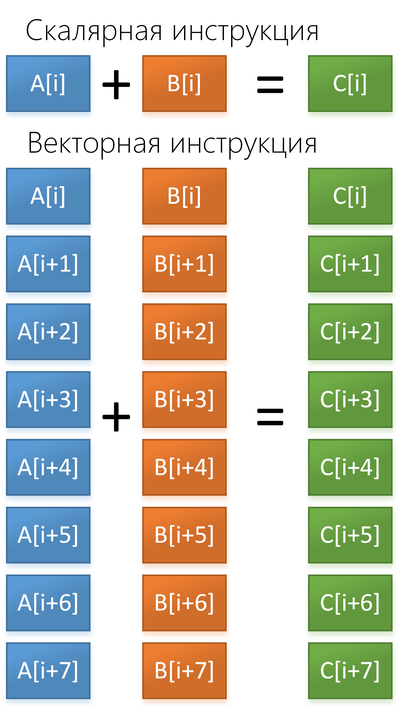

# Механизмы

Множество аппаратных механизмов включают в себя параллельные вычисления. Два наиболее важных механизма являются потоковый параллелизм и векторный параллелизм.

## Потоковый параллелизм

**Аппаратные потоки** это аппаратные сущности, которые могут исполнять приложение самостоятельно. В зависимости от оборудования, ядра процессора могут иметь один или несколько аппаратных потока.

**Программные потоки** это виртуальные аппаратные потоки. Операционная система может создавать больше программных потоков чем существуют аппаратных.

В операционной системе Linux потоки планируются по следующему алгоритму. Внутри системы потоку ставится в соответствие уровень приоритета от 100 до 139 , а всего их 140. Linux связывает с каждым уровнем значение кванта времени. Квант - это количество тиков таймера, в течении которых процесс может выполнятся. В текущей версии Linux таймер работает на частоте 1000 Гц и каждый тик составляет 1 мс. К примеру, с уровнем приоритета 100 получит квант времени в 800 мс, а с уровнем приоритета 139 получат 5 мс.

## Векторный параллелизм

Векторный параллелизм сводится к выполнению одной или нескольких операций над набором данных. Это производится с помощью векторных инструкций над векторными регистрами. Каждый векторный регистр содержит некоторый набор элементов. К примеру, Intel AVX регистр может вместить 8 чисел с плавающей точкой одинарной точности. На суперкомпьютерах вектор может быть длиннее. Так же потоковый параллелизм требует сложных операций над созданием, синхронизацией и управлением потоков. Векторный по отношению к нему, более энергоэффективный.

